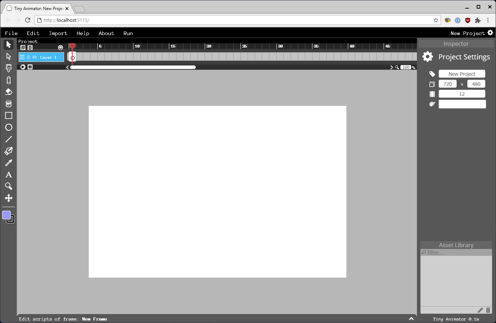

# Tiny Animator
<h6>v0.1a, Based on Wick Editor 0.15</h6>

## Contributing
Very hard, but I'll make a tips & tricks document.

## Plug-ins
This is one of my bigger ideas with the project. Here's an example:
